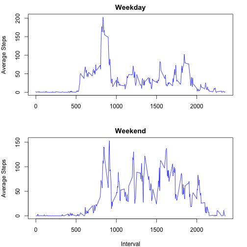

## Loading and preprocessing the data


```r
act <- read.csv("activity.csv", header = T, sep = ",")
dim(act)
```

```
## [1] 17568     3
```

```r
act.good.logical <- complete.cases(act)  ###  this logical vector will be used later
act.clean <- act[act.good.logical,]
dim(act.clean)
```

```
## [1] 15264     3
```

## What is mean total number of steps taken per day?

```r
steps.tot.per.day <- aggregate(steps ~ date, data = act.clean, FUN = sum)
plot(steps.tot.per.day$steps ~ steps.tot.per.day$date, type = "h",
     xlab = "Date", ylab = "Total Number of Steps")
```

 

```r
steps.mean.per.day <- aggregate(steps ~ date, data = act.clean, FUN = mean)
steps.median.per.day <- aggregate(steps ~ date, data = act.clean, FUN = median)

steps.per.day <- cbind(steps.mean.per.day, steps.median.per.day$steps)
names(steps.per.day) <- c("date", "steps.mean", "steps.median")
```


## What is the average daily activity pattern?

```r
steps.mean.per.interval <- aggregate(steps ~ interval, data = act.clean, FUN = mean)
plot(steps.mean.per.interval$steps ~ steps.mean.per.interval$interval, type = "l",
    xlab = "Interval", ylab = "Average Number of Steps")
```

 

```r
steps.mean.per.interval[steps.mean.per.interval$steps == max(steps.mean.per.interval$steps),]
```

```
##     interval    steps
## 104      835 206.1698
```


## Imputing missing values
In the table below, the FALSE value is the number of observations with incomplete values (i.e. containing NAs), and the TRUE value is the number of observations with complete values (i.e. not containing NAs).

```r
table(act.good.logical)
```

```
## act.good.logical
## FALSE  TRUE 
##  2304 15264
```

Will replace the missing values of steps with the daily average.

```r
fillin <- function(x) {
  steps = x[1]
  date = x[2]
  if (is.na(steps)) {
    if (date %in% steps.mean.per.day$date)
      a <- steps.mean.per.day[steps.mean.per.day$date == date, "steps"]
    else
      a <- 0
  }
  else
    a <- steps
  as.integer(a)
}
act.filled <- cbind(subset(act, select = c(-steps)), steps = apply(act[,c('steps', 'date')], 1, FUN = fillin))

###   XXXX  continue with comparison between act and act.filled (point 4)
```


## Are there differences in activity patterns between weekdays and weekends?

```r
wd <- c("Monday", "Tuesday", "Wednesday", "Thursday", "Friday")
weekdayOrWeekend <- function(x) {
  if (weekdays(as.Date(x[1])) %in% wd)
    a <- "weekday"
  else
    a <- "weekend"
  a
}
  
act.wd <- cbind(act.filled, wday = apply(as.data.frame(act.filled[,c("date")]), 1, FUN = weekdayOrWeekend))

steps.mean.per.interval.and.wday <- aggregate(steps ~ interval + wday, data = act.wd, FUN = mean)
t <- steps.mean.per.interval.and.wday    ###  short alias
par(mfrow = c(2, 1), mar = c(4, 4, 2, 2))
w1 <- subset(t, wday == "weekday")
plot(w1$steps ~ w1$interval, type = "l", col = "blue", xlab = "", ylab = "Average Steps", main = "Weekday")
w2 <- subset(t, wday == "weekend")
plot(w2$steps ~ w2$interval, type = "l", col = "blue", xlab = "Interval", ylab = "Average Steps", main = "Weekend")
```

 

